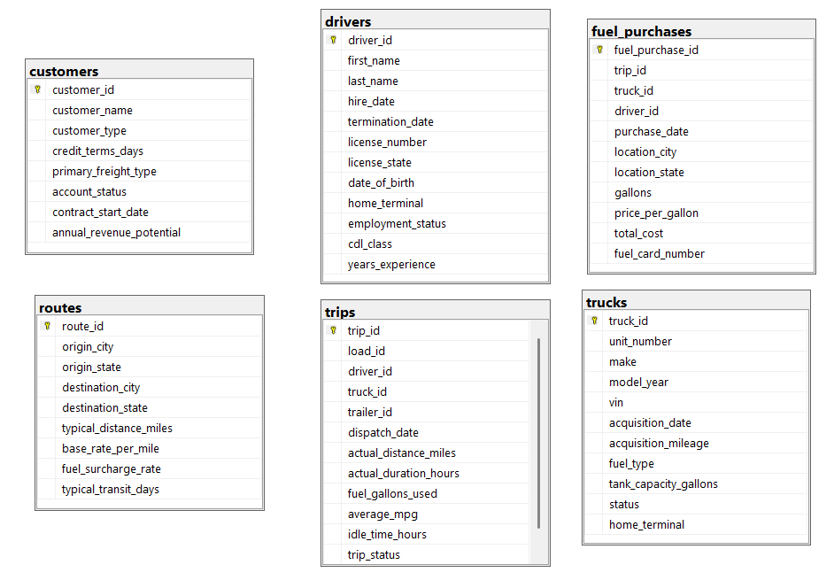
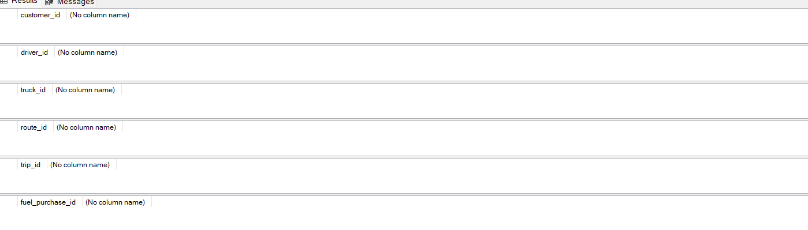

# Proyecto_SQL

Análisis Operativo y de Costos de Transporte Terrestre con SQL Server

## Contexto de proyecto (Overview)

En operaciones de transporte de carga terrestre, el control del consumo de combustible, los tiempos improductivos y la asignación eficiente de choferes y unidades son determinantes para la rentabilidad del negocio.

El objetivo de este proyecto es realizar un análisis exploratorio de datos (EDA) utilizando SQL Server Management Studio (SSMS) sobre la base de datos de la base de datos: Data_log. A través de una selección estratégica de tablas de la data, se auditará la calidad de la información, se verificarán claves e inconsistencias, y se resolverán preguntas de negocio orientadas a medir el rendimiento de la flota, el gasto en diésel y la productividad laboral. Los datos fueron extraidos de la página de kaggle [Logistics Operations Database](https://www.kaggle.com/datasets/yogape/logistics-operations-database?select=DATABASE_SCHEMA.txt).


## Descripción de tablas y columnas 

La base de datos **Data_log** contiene información integrada sobre viajes, conductores, vehículos, rutas, compras de combustible y clientes. Las principales tablas son:

* **trips** → servicios de transporte realizados, distancias recorridas, tiempos de viaje, consumo de combustible y horas de vehículo parado.
* **drivers** → datos del personal de conducción, licencias comerciales, fecha de contratación y años de experiencia.
* **trucks** → características de la flota de vehículos, marca, año de fabricación, número de serie (VIN) y capacidad de tanque.
* **routes** → catálogo de tramos viales autorizados, distancias estándar y tarifas base por milla.
* **fuel_purchases** → transacciones de carga de diésel, estaciones de servicio, galones suministrados y costos totales.
* **customers** → cartera comercial de clientes, términos de crédito y tipo de carga contratada.




## Limpieza de datos 

### Verificación de datos nulos
```sql
-- TABLA customers
SELECT COUNT(*)
FROM customers
WHERE customer_id IS NULL
   OR customer_name IS NULL
   OR customer_type IS NULL
   OR credit_terms_days IS NULL
   OR primary_freight_type IS NULL
   OR account_status IS NULL
   OR contract_start_date IS NULL
   OR annual_revenue_potential IS NULL;

-- TABLA drivers
SELECT COUNT(*)
FROM drivers
WHERE driver_id IS NULL
   OR first_name IS NULL
   OR last_name IS NULL
   OR hire_date IS NULL
   OR termination_date IS NULL
   OR license_number IS NULL
   OR license_state IS NULL
   OR date_of_birth IS NULL
   OR home_terminal IS NULL
   OR employment_status IS NULL
   OR cdl_class IS NULL
   OR years_experience IS NULL;

-- TABLA trucks
SELECT COUNT(*)
FROM trucks
WHERE truck_id IS NULL
   OR unit_number IS NULL
   OR make IS NULL
   OR model_year IS NULL
   OR vin IS NULL
   OR acquisition_date IS NULL
   OR acquisition_mileage IS NULL
   OR fuel_type IS NULL
   OR tank_capacity_gallons IS NULL
   OR status IS NULL
   OR home_terminal IS NULL;

-- TABLA routes
SELECT COUNT(*)
FROM routes
WHERE route_id IS NULL
   OR origin_city IS NULL
   OR origin_state IS NULL
   OR destination_city IS NULL
   OR destination_state IS NULL
   OR typical_distance_miles IS NULL
   OR base_rate_per_mile IS NULL
   OR fuel_surcharge_rate IS NULL
   OR typical_transit_days IS NULL;

-- TABLA trips
SELECT COUNT(*)
FROM trips
WHERE trip_id IS NULL
   OR load_id IS NULL
   OR driver_id IS NULL
   OR truck_id IS NULL
   OR trailer_id IS NULL
   OR dispatch_date IS NULL
   OR actual_distance_miles IS NULL
   OR actual_duration_hours IS NULL
   OR fuel_gallons_used IS NULL
   OR average_mpg IS NULL
   OR idle_time_hours IS NULL
   OR trip_status IS NULL;

-- TABLA fuel_purchases
SELECT COUNT(*)
FROM fuel_purchases
WHERE fuel_purchase_id IS NULL
   OR trip_id IS NULL
   OR truck_id IS NULL
   OR driver_id IS NULL
   OR purchase_date IS NULL
   OR location_city IS NULL
   OR location_state IS NULL
   OR gallons IS NULL
   OR price_per_gallon IS NULL
   OR total_cost IS NULL
   OR fuel_card_number IS NULL
```
Se encontraron los siguientes datos nulos:


#### Tabla drivers


La tabla contiene valores nulos, puesto que aún los conductores se encuentran vigentes.

#### Tabla trip y fuel_purchase


Se evidencia la existencia de valores nulos en los campos de asignación operativa (`driver_id`, `truck_id` y `trailer_id`), correspondientes al conductor, tractocamión y semirremolque (carreta), respectivamente. 

Estos registros no son eliminados de la BD, ya que las métricas cuantitativas del viaje como distancia recorrida, duración, combustible consumido y estado del flete son completamente válidas y completas. Eliminar estas filas sesgaría el cálculo de varios indicadores y registro de servicios.


### Verificación de datos duplicados
```sql
-- TABLA customers
SELECT customer_id, COUNT(*)
FROM customers
GROUP BY customer_id
HAVING COUNT(*) > 1;

-- TABLA drivers
SELECT driver_id, COUNT(*)
FROM drivers
GROUP BY driver_id
HAVING COUNT(*) > 1;

-- TABLA trucks
SELECT truck_id, COUNT(*)
FROM trucks
GROUP BY truck_id
HAVING COUNT(*) > 1;

-- TABLA routes
SELECT route_id, COUNT(*)
FROM routes
GROUP BY route_id
HAVING COUNT(*) > 1;

-- TABLA trips
SELECT trip_id, COUNT(*)
FROM trips
GROUP BY trip_id
HAVING COUNT(*) > 1;

-- TABLA fuel_purchases
SELECT fuel_purchase_id, COUNT(*)
FROM fuel_purchases
GROUP BY fuel_purchase_id
HAVING COUNT(*) > 1
```

No se encontraron valores duplicados en las tablas a trabajar



## Preguntas de Negocio y EDA

Durante el análisis exploratorio se respondieron 15 preguntas clave:
1. ¿Cuántos viajes se han registrado en total y cuántas millas sumaron en conjunto?

```sql
SELECT 
COUNT(*) AS total_viajes,
SUM(actual_distance_miles) AS total_millas_recorridas,
ROUND(AVG(actual_distance_miles), 2) AS promedio_millas_por_viaje
FROM trips;
```


Visión general del volumen de actividad y la escala de la operación de transporte.

2. ¿Cómo se distribuyen los clientes según su categoría comercial?

```sql
SELECT 
customer_type, 
COUNT(*) AS cantidad_clientes
FROM customers
GROUP BY customer_type
ORDER BY cantidad_clientes DESC;
```


Ello permite conocer qué sector económico concentra la mayor cartera de clientes de la empresa.

3. ¿Cuántos camiones tiene la empresa por cada marca?

```sql
SELECT 
make AS marca_camion, 
COUNT(*) AS total_unidades
FROM trucks
GROUP BY make
ORDER BY total_unidades DESC;
```


Composición de la flota vehicular para evaluar la estandarización de marcas y repuestos.

4. ¿Quiénes son los 10 conductores con mayor cantidad de millas acumuladas en viajes concluidos?

```sql
SELECT TOP 10 
d.first_name + ' ' + d.last_name AS conductor,
COUNT(t.trip_id) AS viajes_completados,
SUM(t.actual_distance_miles) AS millas_totales
FROM trips t
INNER JOIN drivers d ON t.driver_id = d.driver_id
WHERE t.trip_status = 'Completed'
GROUP BY d.first_name, d.last_name
ORDER BY millas_totales DESC;
```


Operadores con mayor productividad en ruta, para el reconocimiento de desempeño y control de fatiga laboral de choferes.

5. ¿Cómo se distribuyen los conductores con viajes completados según su rango de experiencia laboral?
```sql
SELECT 
CASE 
    WHEN d.years_experience < 5 THEN 'Menos de 5 años'
    WHEN d.years_experience BETWEEN 5 AND 10 THEN 'De 5 a 10 años'
    ELSE 'Más de 10 años'
    END AS rango_experiencia,
    COUNT(DISTINCT d.driver_id) AS total_conductores
FROM trips t
INNER JOIN drivers d ON t.driver_id = d.driver_id
WHERE t.trip_status = 'Completed'
GROUP BY 
CASE 
    WHEN d.years_experience < 5 THEN 'Menos de 5 años'
    WHEN d.years_experience BETWEEN 5 AND 10 THEN 'De 5 a 10 años'
    ELSE 'Más de 10 años'
    END
ORDER BY total_conductores DESC;
```


La flota operativa está respaldada mayoritariamente por personal veterano: el 66% de los conductores en ruta cuenta con más de 10 años de trayectoria.

6. ¿Cuántas cargas de combustible y qué costo total acumula cada marca de tractocamión?
```sql
SELECT 
    t.make AS marca_camion,
    COUNT(fp.fuel_purchase_id) AS cantidad_recargas,
    ROUND(SUM(fp.gallons), 2) AS galones_abastecidos,
    ROUND(SUM(fp.total_cost), 2) AS costo_total
FROM fuel_purchases fp
INNER JOIN trucks t ON fp.truck_id = t.truck_id
GROUP BY t.make
ORDER BY costo_total DESC;
```


Gasto de combustible con los fabricantes de los tractocamiones, ello facilita la evaluación del costo operativo por marca.

7. ¿Existe una variación en el rendimiento de combustible entre las distintas generaciones de camiones y cómo se distribuye la carga operativa de la flota?

```sql
SELECT 
    t.model_year AS anio_modelo,
    COUNT(DISTINCT t.truck_id) AS cantidad_camiones,
    COUNT(tr.trip_id) AS viajes_realizados,
    ROUND(AVG(tr.average_mpg), 2) AS promedio_mpg
FROM trips tr
INNER JOIN trucks t ON tr.truck_id = t.truck_id
WHERE tr.trip_status = 'Completed'
GROUP BY t.model_year
ORDER BY t.model_year DESC;
```


El 64% de viajes usa camiones 2015 con consumo similar a modelos más recientes, por lo que el ahorro combustible es minimo.

8. ¿Cómo se categorizan los camiones según el volumen de despachos y el kilometraje acumulado en servicios completados?
```sql
SELECT 
t.truck_id,
t.make AS marca_camion,
COUNT(tr.trip_id) AS total_viajes,
SUM(tr.actual_distance_miles) AS millas_totales,
    CASE 
    WHEN SUM(tr.actual_distance_miles) >= 1350000 THEN 'Crítico'
    WHEN SUM(tr.actual_distance_miles) >= 1000000 THEN 'Moderado'
    ELSE 'Bajo'
END AS categoria_utilizacion
FROM trips tr
INNER JOIN trucks t ON tr.truck_id = t.truck_id
WHERE tr.trip_status = 'Completed'
GROUP BY t.truck_id, t.make
ORDER BY millas_totales DESC;
```


Las unidades críticas superan los 950 viajes y los 1.35 millones de millas, alrededor de 92.

9. ¿Qué viajes registran una facturación de diésel desproporcionada frente al consumo reportado por el motor y cuál es el impacto financiero generado?

SQL
```sql
SELECT TOP 10
    t.trip_id,
    t.truck_id,
    d.first_name + ' ' + d.last_name AS conductor,
    ROUND(t.fuel_gallons_used, 2) AS galones_consumo_motor,
    ROUND(SUM(fp.gallons), 2) AS galones_facturados_tarjeta,
    ROUND(SUM(fp.gallons) - t.fuel_gallons_used, 2) AS sobreabastecimiento_galones,
    ROUND((SUM(fp.gallons) - t.fuel_gallons_used) * AVG(fp.price_per_gallon), 2) AS impacto_financiero_perdida_usd
FROM trips t
INNER JOIN fuel_purchases fp ON t.trip_id = fp.trip_id
INNER JOIN drivers d ON t.driver_id = d.driver_id
WHERE t.truck_id IS NOT NULL
GROUP BY t.trip_id, t.truck_id, d.first_name, d.last_name, t.fuel_gallons_used
HAVING (SUM(fp.gallons) - t.fuel_gallons_used) > 20
ORDER BY impacto_financiero_perdida_usd DESC;
```

Anomalías graves de merma o fraude como: desvío de combustible a depósitos externos, compras con tarjetas corporativas para vehículos no autorizados o fugas mecánicas no detectadas por los inyectores.

10. ¿Cuántos choferes operan en cada sede según su categoría de licencia, qué experiencia promedio tienen y cuántos despachos promedian por persona?

```sql
SELECT 
    d.home_terminal AS terminal_base,
    d.cdl_class AS clase_licencia,
    COUNT(DISTINCT d.driver_id) AS total_conductores,
    ROUND(AVG(d.years_experience), 1) AS experiencia_media_anios,
    COUNT(t.trip_id) AS despachos_realizados,
    SUM(t.actual_distance_miles) AS millas_totales,
    ROUND(COUNT(t.trip_id) * 1.0 / NULLIF(COUNT(DISTINCT d.driver_id), 0), 1) AS viajes_promedio_por_conductor
FROM drivers d
INNER JOIN trips t ON d.driver_id = t.driver_id
WHERE t.trip_status = 'Completed'
GROUP BY d.home_terminal, d.cdl_class
ORDER BY d.home_terminal ASC, despachos_realizados DESC;
```


Estructura del personal de conducción por base física, evaluando el grado de habilitación técnica del personal y el promedio de servicios atendidos por cada chofer.

## Conclusiones

1. La mayor parte de la operación depende de camiones antiguos con un kilometraje excesivamente alto, lo que eleva la probabilidad de fallas mecánicas e interrupciones en el servicio. Debido a que las unidades más modernas consumen prácticamente la misma cantidad de combustible, la renovación vehicular no generará ahorros significativos en diésel; su verdadero beneficio radica en asegurar la continuidad operativa y evitar sobrecostos por reparaciones mayores.

2. Existen pérdidas económicas considerables debido a diferencias alarmantes entre el combustible que realmente utiliza el motor y lo que se factura con las tarjetas de la empresa, alcanzando desvíos de miles de dólares en viajes individuales. Este problema evidencia una falta de supervisión y límites de compra en las estaciones de servicio, dejando abierta la puerta a consumos no autorizados o posibles fraudes que impactan directamente las ganancias del negocio.

3. La empresa cuenta con un equipo de conductores altamente calificado, de amplia trayectoria y con una carga de trabajo bien distribuida en todas las terminales. Sin embargo, los sistemas internos presentan fallas constantes al registrar qué chofer o qué vehículo participó en cada despacho, lo que dificulta saber con certeza quién es responsable de cada viaje y limita el control administrativo de la operación.